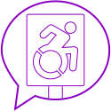
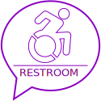
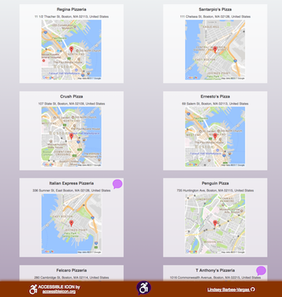

# accessABLE

**accessABLE** provides a space where users can search for local businesses and submit a review of a business's accessibility.

[accessable.herokuapp.com](https://accessable.herokuapp.com "accessABLE")

 *accessABLE Home*

## Overview ##
**accessABLE** is a full stack web application that allows users to search for a business or establishment using the Google Places API. After a general or specific search, the user is able to select a single business in order to see the business's accessibilty reviews and ratings. In order to review a business, a user can register for access to *accessABLE* (using [passportjs.org](http://www.passportjs.org/ "Passport")). After initial registration, the user is able to log in with their username and password and review a business.  A review consists of answering YES or NO to six accessibility statements.  The user is also able to enter a text review before submitting their review.  

### Technology Stack ###
*  Front-end technologies
    +  HTML, CSS, JavaScript, jQuery, JSON
*  Server technologies
    +  Node.js, Express, Passport.js, MongoDB, Mongoose, Chai, Axios, Pug, Google Places API
*  Development Environment
    +  Sublime Text, Postman
* Additional Tools
    +  Google Fonts, Font Awesome, Flexbox

### Icons ###
I would like to credit [The Accessible Icon Project](http://accessibleicon.org/ "The Accessible Icon Project") for the following icon that I used throughout this project: 

I created the following svg icons through [Vectr.com](https://vectr.com/ "Vectr"):

### Desktop View Examples ###
  
*login*
* * *
  
*user registration*
* * *
  
*search results*
* * *
  
*single result*
* * *
  
*review*
* * *
  
*review textbox*

### Mobile View Examples ###
  
*home*
* * *
  
*search results*
* * *
  
*review icons and percentages*
* * *
  
*review submit*